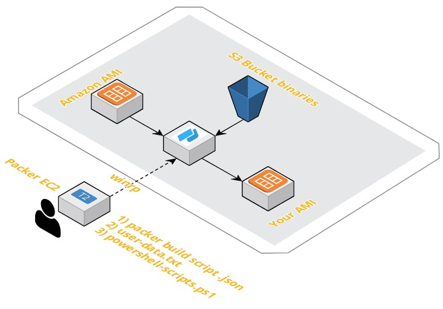

# Packer with AWS

## What is Packer ?
Packer is an agnostic Image builder developed by Hasicorp.

## What can it do ?
Packer will take an exising AWS AMI, tailor it to your needs and repackgage it as your own custom AMI.
In Short it will create repeatable AMI's with all your common post EC2 instance install requirments, which will lower the time your provisioning team need to get the instance ready for your Dev's.

## What will this repo do ?
This repo will create your own custom Windows server AMI within AWS and carry the following steps:
- Push a user-data powershell script to setup winrp, which allows Packer to connect to windows.
- Apply a role to the temp build instance to avoid the need to use hard coded username and password credentials. 
- Run a further powershell script which installs Python, upgrades PIP and installs AWS CLI.
- Files and binaries are copied from an AWS S3 bucket.

<p align="center"> 

</p>

## Great, how do I create my custom AMI ?
- Install Packer on your Windows or Linux host: https://www.packer.io/docs/install/index.html
- Ensure your host has a role associated to it or AWS configure is setup with appropriate permissions for iam:PassRole (See below).
- Clone this Repo. 
- Edit the packer file windows-1.json and modify for your region of choice and AWS AMI id.
- Run: packer build windows-1.json
- This Reop was fully tested with Packer v1.2.3

## What's this about IAM roles ?

- You need to ensure your host running Packer has IAM rights to allow an iam:Passrole as per below: 

```json
{
    "Version": "2012-10-17",
    "Statement": [
        {
            "Sid": "PackerIAMPassRole",
            "Effect": "Allow",
            "Action": "iam:PassRole",
            "Resource": ["*"]
        }
    ]
}
```

- You also need to create an IAM role for your new Packer instance (e.g. packer-s3-ro) to read your S3 bucket binaries/files.

```json
{
   "Version": "2012-10-17",
   "Statement": [
     {
       "Effect": "Allow",
       "Action": ["s3:GetObject"],
       "Resource": ["arn:aws:s3:::<BUCKET-NAME>"]
     }
   ]
 }
```

- Ensure you set all IAM policies down to minimum requirements after testing

You can tailor this to work with Linux quite easily. In fact Linux AMI's are much easier to create as they don't require wimrm.\
Linux uses ssh and doesn't require a user-data file to set up the intial communication between the packer builder host and temporary ec2 builder instance.
