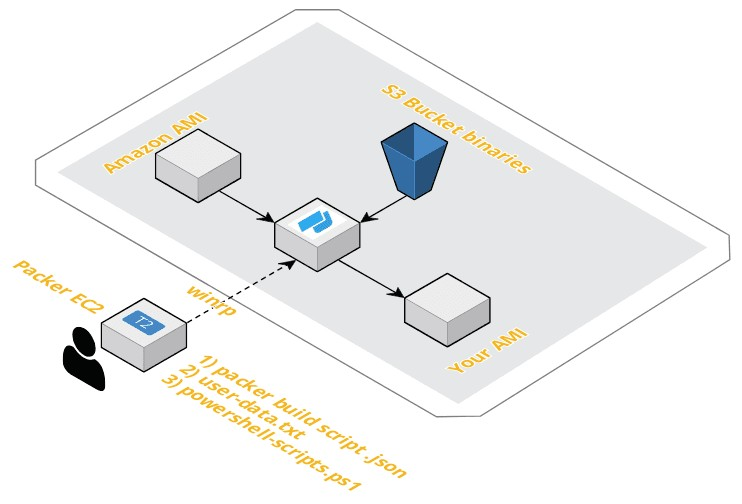

# Packer with AWS

## What is Packer ?
Packer is an agnostic Image builder developed by Hasicorp.

## What does this repo provide ?
This is a work in progress collection of Packer examples to allow you to build Images within Public clouds.\
Current examples include:

### Windows-1
Will create your own custom windows server ami within AWS and carry the following steps:
- Push a user-data powershell script to setup winrp, which allows Packer to connect.
- Apply a role to the AMI to avoid the need to use hard coded username and password credentials. 
- Run a further powershell script which installs Python, upgrades PIP, installs AWS CLI.
- The IAM role will allow you to download files and binaries from an AWS S3 bucket.

<p align="center"> 

</p>

## How do I use Packer with these repos ?
- Install Packer on your Windows or Linux host: https://www.packer.io/docs/install/index.html
- Ensure your host has a role associated to it or AWS configure is setup with appropriate permissions for iam:PassRole (See below).
- Clone this Repo. 
- Edit the packer file <packer>.json and modify for your region of choice and AWS AMI id.
- Run: packer build <packer>.json (e.g. packer windows-1.json)
- These Reops were tested with Packer v1.2.3

## What's this about roles ?

- You need to ensure your host running Packer has IAM rights to allow an iam:Passrole as per below: 

```json
{
    "Version": "2012-10-17",
    "Statement": [
        {
            "Sid": "PackerIAMPassRole",
            "Effect": "Allow",
            "Action": "iam:PassRole",
            "Resource": ["*"]
        }
    ]
}
```

- You also need to create an IAM role for your new Packer instance (e.g. packer-s3-ro) to read your S3 bucket binaries/files.

```json
{
   "Version": "2012-10-17",
   "Statement": [
     {
       "Effect": "Allow",
       "Action": ["s3:GetObject"],
       "Resource": ["arn:aws:s3:::<BUCKET-NAME>"]
     }
   ]
 }
```

- Ensure you set all IAM policies down to minimum requirements after testing
